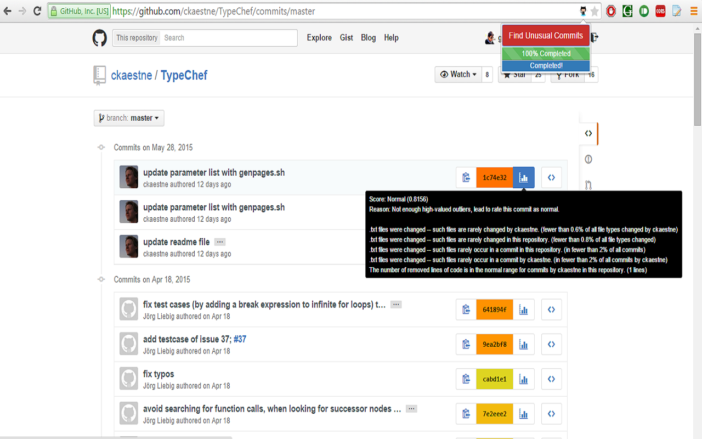

### Unusual Commit Google Chrome Extension (<a href="https://chrome.google.com/webstore/detail/unusual-commits/hncljhkoaognphcmhdelchclkogepnae?hl=en-US&gl=US" target="_blank">Link</a>)

This is chrome extension to mark unusual commits in commit history on Github.

The complete backend can be accessed at [Unusual Git Commit](https://github.com/goyalr41/UnusualGitCommit). 

<strong><a href="https://chrome.google.com/webstore/detail/unusual-commits/hncljhkoaognphcmhdelchclkogepnae?hl=en-US&gl=US" target="_blank">Unusual Commits</a> -- link to chrome plugin. </strong> 

It works only on commit history page of a repository, you will see an icon (The icon with above heading) in the address bar as in the screenshot. 

